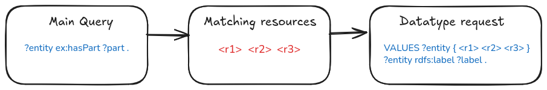

# Query model

Unravel RDF provides a focus-oriented programming model for incrementally
constructing SPARQL queries.

Instead of assembling SPARQL strings, applications describe RDF graph
exploration through navigation steps. Each operation extends the query graph
while retaining a current **focus**: the resource currently being explored.

## Contents

- [Basic query structure](#basic-query-structure)
- [RDF terms and variables](#rdf-terms-and-variables)
- [Navigation primitives](#navigation-primitives)
  - [Outgoing navigation](#outgoing-navigation)
  - [Incoming navigation](#incoming-navigation)
  - [Bidirectional navigation](#bidirectional-navigation)
- [Nested exploration](#nested-exploration)
- [Switching focus](#switching-focus)
- [Fetching literal values](#fetching-literal-values)
- [Filtering values](#filtering-values)
- [Transforming values](#transforming-values)
- [Building the final query](#building-the-final-query)

## Basic query structure

A query typically starts from an existing
[configuration](configuration). It then defines the required namespace
prefixes and introduces an initial query variable using `something()`.

```javascript
const query = UnravelSession(config)
  .prefix("ex", "http://example.org/")
  .something("entity", entity =>
    entity.out("ex:hasProperty", "?value")
  )
  .select("entity", "value")
```

This produces the following graph pattern:

```sparql
?entity ex:hasProperty ?value .
```

The `entity` variable is the initial query focus. The call to `out()`
adds a triple pattern originating from that focus and introduces the
`?value` variable.

## RDF terms and variables

Navigation methods accept RDF terms and query variables as strings.

- Use a full URI, such as `"http://example.org/property"`, for an RDF term
- Use a configured prefixed name, such as `"ex:property"`, for an RDF term
- Prefix a name with `?`, such as `"?target"`, for a SPARQL variable

For example:

```javascript
something("source", source =>
  source.out("ex:rel", "?target")
)
```

Generates:

```sparql
?source ex:rel ?target
```

## Navigation primitives

The query graph is extended from the current focus with three navigation
operations.

| Operation | Generated pattern | Description |
|---|---|---|
| `out(property, target)` | `?focus property ?target` | Follows an outgoing relationship |
| `in(property, target)` | `?target property ?focus` | Follows an incoming relationship |
| `traverse(property, target)` | Both patterns in a `UNION` | Explores a relationship in either direction |

### Outgoing navigation

Use `out()` to follow a property from the current focus, which becomes the
subject of the generated triple pattern.

```javascript
something("entity", entity =>
  entity.out("ex:hasPart", "?part")
)
```

```sparql
?entity ex:hasPart ?part .
```

### Incoming navigation

Use `in()` to find resources pointing to the current focus, which becomes
the object of the generated triple pattern.

```javascript
something("entity", entity =>
  entity.in("ex:isPartOf", "?parent")
)
```

```sparql
?parent ex:isPartOf ?entity .
```

### Bidirectional navigation

Use `traverse()` when the direction of a relationship is unknown or should
be ignored.

```javascript
something("entity", entity =>
  entity.traverse("ex:relatedTo", "?other")
)
```

```sparql
{
  ?entity ex:relatedTo ?other .
}
UNION
{
  ?other ex:relatedTo ?entity .
}
```

## Nested exploration

A navigation operation can receive a callback to continue exploration from
the newly introduced variable.

```javascript
something("source", source =>
  source.out("ex:rel", "?target", target =>
    target.out("ex:rel2", "?value")
  )
)
```

This generates:

```sparql
?source ex:rel ?target .
?target ex:rel2 ?value .
```

Nested exploration is convenient when the query follows a direct path through
the RDF graph.

## Switching focus

For larger queries, use `from()` to return to a variable introduced earlier
and make it the current focus again.

```javascript
something("source", source =>
  source.out("ex:rel", "?target")
)
.from("target", target =>
  target.out("ex:rel2", "?value")
)
```

This produces the same graph pattern as the nested example:

```sparql
?source ex:rel ?target .
?target ex:rel2 ?value .
```

Use nested callbacks for local traversal paths and `from()` when returning
to an earlier variable improves the readability of a larger query.

## Fetching literal values

RDF graphs often contain both structural relationships and literal
properties. Structural relationships are usually required to identify
matching resources, whereas literal properties (such as `rdfs:label`,
`schema:name`, or `skos:prefLabel`) are primarily used for display.

Unravel distinguishes these two types of information. Structural
relationships are evaluated by the main SPARQL query, while literal
properties requested with `datatype()` are retrieved afterwards using
batched requests.

Instead of including literal property patterns in the main SPARQL query,
Unravel first executes the structural query. Once matching resources have
been identified, it retrieves the requested literal values through
additional batched requests (see
[Batch processing size](configuration#batch-processing-size)).

This design avoids the use of SPARQL `OPTIONAL` patterns. In many RDF
datasets, literal properties are not defined for every resource. Rather
than executing a single complex query containing multiple `OPTIONAL`
clauses, Unravel retrieves the graph structure first and then fetches only
the available literal values for the resources that were found.



*Figure — Literal values are retrieved after the main structural query using
batched requests.*

For example:

```javascript
something("entity", entity =>
  entity.out("ex:hasPart", "?part")
        .datatype("rdfs:label", "label")
)
```

The main query only contains the structural pattern:

```sparql
?entity ex:hasPart ?part .
```

After retrieving the matching resources, Unravel issues additional
requests such as:

```sparql
VALUES ?entity {
  <resource1>
  <resource2>
  ...
}

?entity rdfs:label ?label .
```

### Response format

The main query result remains a standard SPARQL Results JSON response:
projected variables are declared in `head.vars`, and their solution mappings
are returned in `results.bindings`.

Literal values retrieved through `datatype()` are returned separately in
`results.datatypes`. This member is an Unravel extension and is not part of
the SPARQL Results JSON specification.

```javascript
response.results.datatypes
```

The structure is indexed first by the datatype result reference, then by the
canonical RDF representation of the resource:

```text
results.datatypes[resultReference][resourceIri] = rdfTerms[]
```

For example:

```json
{
  "head": {
    "vars": ["entity"]
  },
  "results": {
    "bindings": [
      {
        "entity": {
          "type": "uri",
          "value": "http://example.org/resource/1"
        }
      }
    ],
    "datatypes": {
      "label": {
        "http://example.org/resource/1": [
          {
            "type": "literal",
            "value": "Example resource",
            "xml:lang": "en"
          },
          {
            "type": "literal",
            "value": "Ressource d'exemple",
            "xml:lang": "fr"
          }
        ]
      }
    }
  }
}
```

In this example:

- `entity` is returned by the main structural query.
- `label` is the reference supplied to `datatype("rdfs:label", "label")`.
- `http://example.org/resource/1` is the value of `entity` and acts as the
  join key between the main bindings and the datatype values.
- The value associated with a resource is always an array of RDF terms.
  This remains true even when the RDF property is expected to be functional,
  because RDF properties may have multiple values.
- Each item in the array uses the standard SPARQL Results JSON representation
  of an RDF term, including its RDF datatype or language tag when applicable.

### Missing values

A resource may have no value for a requested datatype property. Clients must
therefore not assume that every resource appearing in `results.bindings` also
has an entry in `results.datatypes`.

When possible, Unravel represents a known resource with no values using an
empty array:

```json
{
  "datatypes": {
    "label": {
      "http://example.org/resource/without-label": []
    }
  }
}
```

An absent resource key also means that no datatype value is available. Clients
should therefore safely handle both cases:

```javascript
const labels =
  response.results.datatypes?.label?.[entityIri] ?? [];
```

### Resource identifiers

The second-level key is the canonical RDF representation of the resource,
rather than an arbitrary application identifier. URI resources are therefore
indexed by their full IRI string:

```text
http://example.org/resource/1
```

Datatype retrieval is primarily designed for URI subjects. If a selected
resource can be a blank node, its representation and scope must be defined
explicitly before it is used as a datatype index key. For example, a blank
node identifier such as `_:b1` is only meaningful within the scope of the
specific RDF result set or query execution.

### Trade-offs

This strategy trades a higher number of lightweight SPARQL requests for
simpler structural queries. It avoids unnecessary `OPTIONAL` patterns and
prevents multivalued display properties from multiplying the solution mappings
of the main query.

It is especially useful when a user interface needs labels, names, comments,
or other display-oriented literals after the structural resources have already
been identified.

## Filtering values

Filters are built incrementally from the current focus.

```javascript
something("entity", entity =>
  entity.out("ex:name", "?name", name =>
    name.filter.regex("^Arab")
  )
)
```

Equivalent SPARQL:

```sparql
?entity ex:name ?name .
FILTER regex(?name, "^Arab")
```

Available filter operations include:

| Operation | Description |
|---|---|
| `filter.not(expression)` | Negates an expression |
| `filter.isLiteral` | Matches literals |
| `filter.isUri` | Matches URIs |
| `filter.isBlank` | Matches blank nodes |
| `filter.regex(pattern, flags)` | Matches a regular expression |
| `filter.contains(value)` | Tests string containment |
| `filter.strStarts(value)` | Tests a string prefix |
| `filter.strEnds(value)` | Tests a string suffix |
| `filter.equal(value)` | Tests equality |
| `filter.notEqual(value)` | Tests inequality |
| `filter.inf(value)` | Tests lower-than comparison |
| `filter.infEqual(value)` | Tests lower-than-or-equal comparison |
| `filter.sup(value)` | Tests greater-than comparison |
| `filter.supEqual(value)` | Tests greater-than-or-equal comparison |

## Transforming values

Use `bind()` to create a new variable from a SPARQL expression.

```javascript
something("entity", entity =>
  entity.out("ex:name", "?name", name =>
    name.bind("shortName").subStr(0, 10)
  )
)
```

Equivalent SPARQL:

```sparql
?entity ex:name ?name .

BIND(
  SUBSTR(?name, 0, 10)
  AS ?shortName
)
```

Supported transformations include:

| Operation | SPARQL function |
|---|---|
| `.bind(variable).subStr(start, length)` | `SUBSTR()` |
| `.bind(variable).replace(pattern, replacement, flags)` | `REPLACE()` |
| `.bind(variable).abs()` | `ABS()` |
| `.bind(variable).round()` | `ROUND()` |
| `.bind(variable).ceil()` | `CEIL()` |
| `.bind(variable).floor()` | `FLOOR()` |
| `.bind(variable).rand()` | `RAND()` |
| `.bind(variable).datatype()` | `DATATYPE()` |
| `.bind(variable).str()` | `STR()` |

## Building the final query

A query model can combine:

- Navigation through RDF relationships
- Introduction of query variables
- Nested exploration and focus switching
- Filters
- Value transformations

The final SPARQL query is generated when the query is committed for
execution.

```javascript
query
  .select("entity", "value")
  .commit()
```
